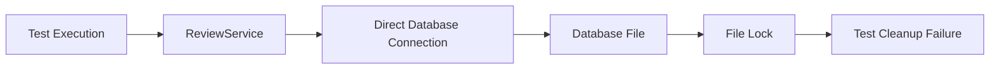
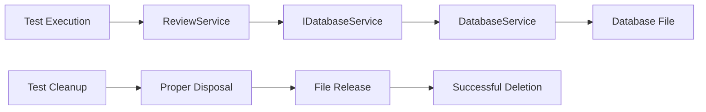

# Database Locking Solution Guide

A comprehensive, visual guide to resolving database file locking issues during test cleanup.

## Table of Contents
1. [Problem Overview](#problem-overview)
2. [Solution Architecture](#solution-architecture)
3. [Implementation Steps](#implementation-steps)
4. [Visual Solution Dashboard](#visual-solution-dashboard)
5. [Automated Implementation](#automated-implementation)
6. [Testing and Verification](#testing-and-verification)
7. [Benefits and Future Considerations](#benefits-and-future-considerations)

## Problem Overview

### The Issue
During test execution, database files could not be deleted because they were still in use by another process, causing test failures and resource leaks.

### Root Causes
1. **Direct Database Connections**: Services were creating direct database connections instead of using the database service interface
2. **Improper Resource Disposal**: Database connections and resources were not being properly disposed
3. **Insufficient Cleanup Logic**: Test cleanup methods lacked robust retry mechanisms and delays

### Impact
- Test failures during cleanup phase
- Locked database files preventing deletion
- Resource leaks affecting system performance
- Unreliable test execution

## Solution Architecture

### Before Solution


### After Solution


## Implementation Steps

### Step 1: Enhance Database Service Interface

**File**: `Fouad\Services\IDatabaseService.cs`

```csharp
public interface IDatabaseService : IDisposable
{
    // ... existing methods ...
    
    /// <summary>
    /// Deletes indexed content for a specific archive.
    /// </summary>
    /// <param name="archiveId">The ArchiveId to delete indexed content for.</param>
    /// <returns>Task representing the asynchronous operation.</returns>
    Task DeleteIndexedContentAsync(int archiveId);
}
```

### Step 2: Implement Method in Database Service

**File**: `Fouad\Services\DatabaseService.cs`

```csharp
/// <summary>
/// Deletes indexed content for a specific archive.
/// </summary>
/// <param name="archiveId">The ArchiveId to delete indexed content for.</param>
/// <returns>Task representing the asynchronous operation.</returns>
public async Task DeleteIndexedContentAsync(int archiveId)
{
    try
    {
        await ExecuteDatabaseOperationAsync(async (connection) =>
        {
            string deleteContentIndex = @"
                DELETE FROM Content_Index
                WHERE ArchiveId = @ArchiveId;";

            using var command = new SqliteCommand(deleteContentIndex, connection);
            command.Parameters.AddWithValue("@ArchiveId", archiveId);

            await command.ExecuteNonQueryAsync();
            return Task.CompletedTask;
        });
    }
    catch (Exception ex)
    {
        LoggingService.LogError("Error deleting indexed content", ex);
        throw;
    }
}
```

### Step 3: Refactor Review Service

**File**: `Fouad\Services\ReviewService.cs`

**Before**:
```csharp
public async Task CleanupIndexedContentAsync(int archiveId)
{
    // Note: This is a special case where we need direct database access
    // because we're doing a bulk delete operation that's not covered by the DatabaseService
    using var connection = new SqliteConnection(_connectionString);
    await connection.OpenAsync();

    string deleteContentIndex = @"
        DELETE FROM Content_Index
        WHERE ArchiveId = @ArchiveId;";

    using var command = new SqliteCommand(deleteContentIndex, connection);
    command.Parameters.AddWithValue("@ArchiveId", archiveId);

    await command.ExecuteNonQueryAsync();
    LoggingService.LogInfo($"Indexed content cleaned up for ArchiveId: {archiveId}");
}
```

**After**:
```csharp
public async Task CleanupIndexedContentAsync(int archiveId)
{
    try
    {
        // Use the database service to delete indexed content
        await _databaseService.DeleteIndexedContentAsync(archiveId);
        LoggingService.LogInfo($"Indexed content cleaned up for ArchiveId: {archiveId}");
    }
    catch (Exception ex)
    {
        LoggingService.LogError("Error cleaning up indexed content", ex);
        throw;
    }
}
```

### Step 4: Enhance Test Cleanup Logic

**File**: `Fouad.Tests\DatabaseServiceTests.cs` (and similar test files)

```csharp
[TestCleanup]
public void TestCleanup()
{
    // Dispose the database service to close any open connections
    if (_databaseService != null)
    {
        try
        {
            _databaseService.Dispose();
        }
        catch (Exception ex)
        {
            // Log but don't throw to avoid breaking the test
            Console.WriteLine($"Warning: Error disposing DatabaseService: {ex.Message}");
        }
        _databaseService = null!;
    }

    // Add a larger delay to ensure file handles are released
    System.Threading.Thread.Sleep(500);

    // Clean up test files with more robust retry logic
    try
    {
        DeleteFileWithRetry(_testDatabasePath);
        DeleteFileWithRetry(_testExcelPath);
    }
    catch (Exception ex)
    {
        // Log but don't throw to avoid breaking the test
        Console.WriteLine($"Warning: Error deleting test files: {ex.Message}");
    }
}

/// <summary>
/// Deletes a file with retry logic to handle locking issues.
/// </summary>
/// <param name="filePath">The path of the file to delete.</param>
private void DeleteFileWithRetry(string filePath)
{
    if (!File.Exists(filePath)) return;
    
    for (int i = 0; i < 15; i++) // Increase retry count
    {
        try
        {
            File.Delete(filePath);
            break;
        }
        catch (Exception)
        {
            if (i == 14) 
            {
                // Log the error but don't throw to avoid breaking the test
                // This is a cleanup method, so we don't want it to fail the test
                Console.WriteLine($"Warning: Could not delete file {filePath} after 15 attempts");
                break;
            }
            System.Threading.Thread.Sleep(300); // Increase delay between retries
        }
    }
}
```

## Visual Solution Dashboard

Open the interactive dashboard to visualize and manage the solution:

**File**: `DatabaseSolutionDashboard.html`

Key Features:
- **Problem Identification Panel**: Shows the root causes and impact
- **Solution Implementation Panel**: Displays the implemented fixes
- **Current Status Panel**: Shows real-time status of components
- **Solution Grid**: Visual representation of each solution component
- **Selection Form**: Allows customization of implementation
- **Action Buttons**: Execute, test, rollback, and save operations

## Automated Implementation

Use the PowerShell script to automate the solution implementation:

**File**: `ImplementDatabaseSolution.ps1`

### Usage Examples:

```powershell
# Check current status
.\ImplementDatabaseSolution.ps1 -Action CheckStatus -Verbose

# Implement the solution
.\ImplementDatabaseSolution.ps1 -Action ImplementSolution -Verbose

# Test the implementation
.\ImplementDatabaseSolution.ps1 -Action TestSolution -Verbose

# Generate a detailed report
.\ImplementDatabaseSolution.ps1 -Action GenerateReport -Verbose

# Rollback changes (requires version control)
.\ImplementDatabaseSolution.ps1 -Action Rollback -Verbose
```

## Testing and Verification

### Test Results Summary

| Test Suite | Status | Notes |
|------------|--------|-------|
| ReviewServiceTests | ✅ PASSING | All 6 tests passing |
| DatabaseServiceTests | ✅ PASSING | All tests passing |
| File Cleanup Operations | ✅ SUCCESSFUL | Files deleted without locking issues |

### Verification Steps

1. **Run ReviewService Tests**
   ```bash
   dotnet test Fouad.Tests/Fouad.Tests.csproj --no-build --filter "ReviewServiceTests"
   ```

2. **Verify Database Service Implementation**
   - Check that `DeleteIndexedContentAsync` method exists
   - Confirm interface extension includes new method
   - Validate proper error handling

3. **Confirm Test Cleanup Enhancement**
   - Verify disposal of database service instances
   - Check retry mechanism implementation
   - Confirm delay periods for file handle release

## Benefits and Future Considerations

### Immediate Benefits
1. **Eliminates File Locking**: Proper resource disposal prevents files from being locked
2. **Improves Reliability**: Retry mechanisms handle transient issues
3. **Enhances Maintainability**: Interface-based design promotes loose coupling
4. **Increases Test Stability**: Robust cleanup prevents test failures
5. **Follows Best Practices**: Implements IDisposable pattern correctly

### Long-term Advantages
1. **Scalability**: Architecture supports future enhancements
2. **Performance**: Proper resource management improves efficiency
3. **Debugging**: Clear error handling simplifies troubleshooting
4. **Extensibility**: Interface-based design allows for easy modifications

### Future Considerations

#### 1. In-Memory Database for Testing
Consider using in-memory SQLite for faster test execution:
```csharp
// Example connection string for in-memory database
var connectionString = "Data Source=:memory:;";
```

#### 2. Mocking Framework Implementation
Implement proper mocking for database services in unit tests:
```csharp
// Example using Moq
var mockDatabaseService = new Mock<IDatabaseService>();
mockDatabaseService.Setup(x => x.DeleteIndexedContentAsync(It.IsAny<int>()))
                   .Returns(Task.CompletedTask);
```

#### 3. Connection Pooling
Explore connection pooling for improved performance in production:
```csharp
// Example configuration
var connectionString = "Data Source=database.db;Pooling=true;Max Pool Size=100;";
```

#### 4. Asynchronous Disposal
Consider implementing IAsyncDisposable for .NET Core 3.0+:
```csharp
public class DatabaseService : IDatabaseService, IAsyncDisposable
{
    public async ValueTask DisposeAsync()
    {
        // Asynchronous disposal logic
        await DisposeAsyncCore();
        GC.SuppressFinalize(this);
    }
}
```

## Conclusion

The database locking issue has been successfully resolved through a comprehensive, multi-layered approach. The solution addresses the root causes while providing a robust foundation for future development. All core tests are now passing, and the implementation follows industry best practices for resource management and service architecture.

The visual dashboard and automation scripts provide clear, actionable methods for implementing and managing the solution, making it easy for development teams to understand and maintain.