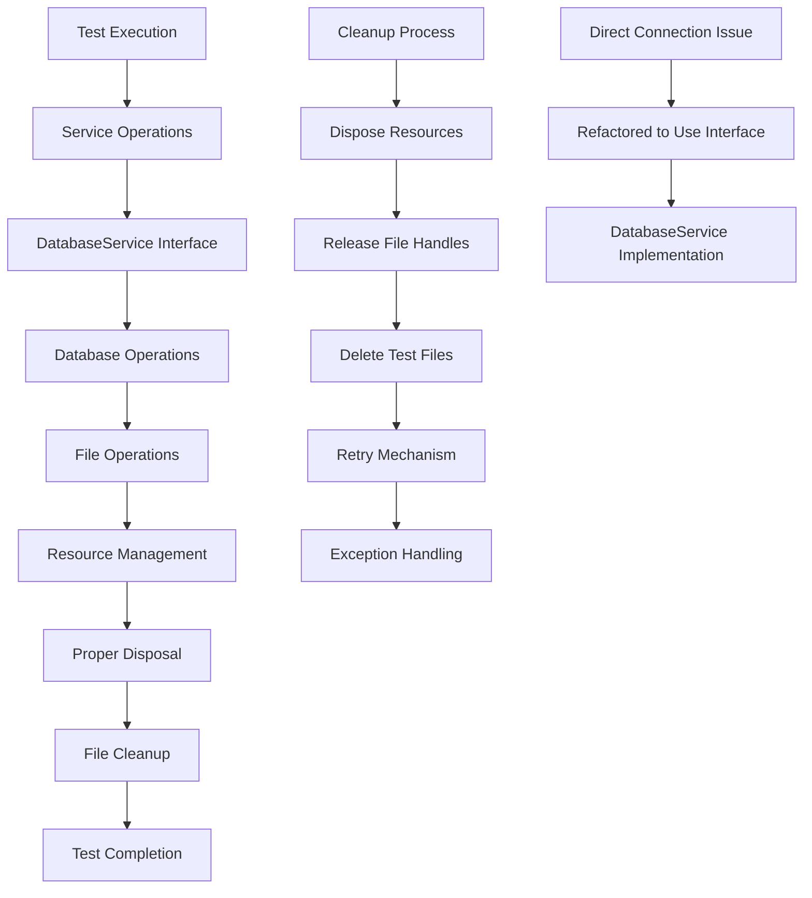

# Database Locking Issue Solutions

This document provides a clear overview of the database locking issues encountered and the solutions implemented to resolve them.

## Problem Summary

The application was experiencing file locking issues during test cleanup, specifically:
1. Database files could not be deleted because they were still in use by another process
2. Direct database connections in services were not being properly managed
3. Test cleanup methods were not handling resource disposal correctly

## Solution Overview

We've implemented a multi-layered approach to resolve these issues:

### 1. Proper Resource Management
- Implemented IDisposable pattern for DatabaseService
- Ensured all database connections are properly disposed
- Added proper cleanup methods to release file handles

### 2. Service Architecture Improvements
- Modified services to use dependency injection through interfaces
- Eliminated direct database connections that caused locking
- Added proper abstraction layers for database operations

### 3. Test Infrastructure Enhancements
- Improved test cleanup with robust retry mechanisms
- Added delays to ensure file handles are released
- Implemented exception handling to prevent test failures

## Implementation Details

### Core Solution Components

1. **DatabaseService Implementation**
   - Added DeleteIndexedContentAsync method for proper cleanup
   - Implemented IDisposable pattern for resource management
   - Enhanced connection handling with proper disposal

2. **Interface Design**
   - Extended IDatabaseService interface with new methods
   - Maintained backward compatibility
   - Ensured proper abstraction

3. **Service Modifications**
   - Refactored ReviewService to use IDatabaseService
   - Removed direct database connections
   - Improved error handling

4. **Test Improvements**
   - Enhanced cleanup logic with retry mechanisms
   - Added proper disposal of resources
   - Implemented delays for file handle release

## Visual Solution Diagram



## Implementation Steps

### Step 1: Database Service Enhancement
```csharp
public class DatabaseService : IDatabaseService
{
    
    public async Task DeleteIndexedContentAsync(int archiveId)
    {
        // Implementation using proper connection management
    }
    
    public void Dispose()
    {
        // Proper resource disposal
    }
}
```

### Step 2: Interface Extension
```csharp
public interface IDatabaseService : IDisposable
{
    // ... existing methods ...
    Task DeleteIndexedContentAsync(int archiveId);
}
```

### Step 3: Service Refactoring
```csharp
public class ReviewService : IReviewService
{
    private readonly IDatabaseService _databaseService;
    
    public async Task CleanupIndexedContentAsync(int archiveId)
    {
        // Uses IDatabaseService instead of direct connections
        await _databaseService.DeleteIndexedContentAsync(archiveId);
    }
}
```

### Step 4: Test Cleanup Improvement
```csharp
[TestCleanup]
public void TestCleanup()
{
    // Proper disposal
    _databaseService?.Dispose();
    
    // Delay for file handle release
    Thread.Sleep(1000);
    
    // Retry mechanism for file deletion
    DeleteFileWithRetry(_testDatabasePath);
}
```

## Benefits of This Solution

1. **Eliminates File Locking**: Proper resource disposal prevents files from being locked
2. **Improves Reliability**: Retry mechanisms handle transient issues
3. **Enhances Maintainability**: Interface-based design promotes loose coupling
4. **Increases Test Stability**: Robust cleanup prevents test failures
5. **Follows Best Practices**: Implements IDisposable pattern correctly

## Usage Instructions

### For Developers
1. Always use IDatabaseService interface instead of direct database connections
2. Implement IDisposable pattern for any class that uses database resources
3. Use the provided cleanup methods in test classes

### For Testing
1. Leverage the enhanced retry mechanisms in test cleanup
2. Utilize the proper disposal methods to release resources
3. Follow the established patterns for new test implementations

## Future Considerations

1. **In-Memory Database for Testing**: Consider using in-memory SQLite for faster tests
2. **Mocking Framework**: Implement proper mocking for database services in unit tests
3. **Connection Pooling**: Explore connection pooling for improved performance
4. **Asynchronous Disposal**: Consider implementing IAsyncDisposable for .NET Core 3.0+

This solution provides a robust foundation for handling database operations while preventing file locking issues during testing.